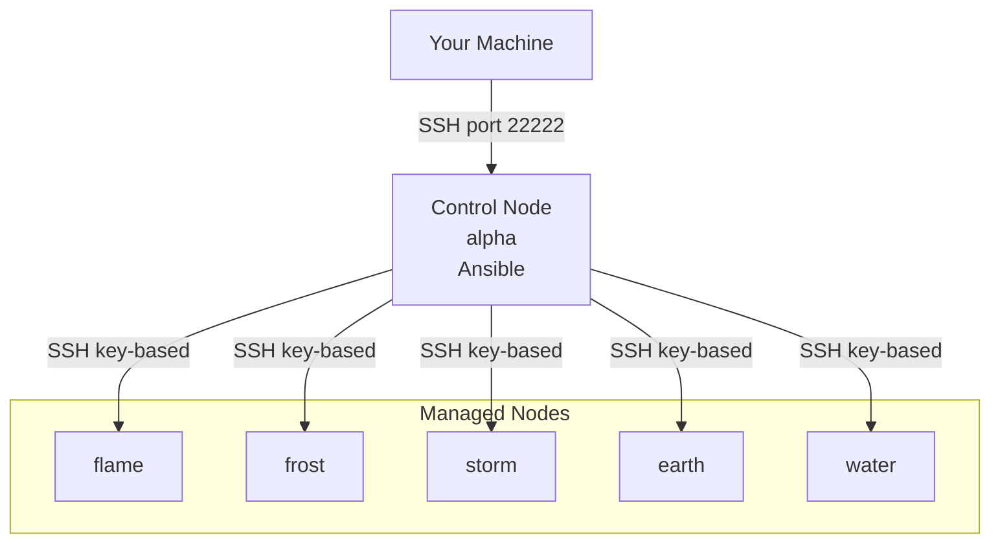

# **`Ansible Lab`**

```text
  ___              _ _     _        _       _
 / _ \            (_) |   | |      | |     | |
/ /_\ \_ __  ___ _| | |__ | | ___  | | __ _| |__
|  _  | '_ \/ __| | | '_ \| |/ _ \ | |/ _` | '_ \
| | | | | | \__ \ | | |_) | |  __/ | | (_| | |_) |
\_| |_/_| |_|___/_|_|_.__/|_|\___| |_|\__,_|_.__/
```

A structured hands-on environment to **learn Ansible** using a **container-based sandbox**.
The goal: **understand how Ansible thinks**, not just how to run commands.

---

# ⚡ TL;DR – Quick Start

```bash
cd labsetup
./ansible_lab.py build      # build images (requires internet once)
./ansible_lab.py setup      # create control + nodes + SSH trust + prompts
ssh sysansible@localhost -p 22222
```

Daily workflow:

```bash
./ansible_lab.py start
./ansible_lab.py stop
```

Reset fully:

```bash
./ansible_lab.py decom
```

---

# ✓ Prerequisites (BEFORE YOU RUN ANYTHING)

**Host OS**

- Linux recommended (RHEL / Rocky / Ubuntu / Fedora)
- MacOS supported (Docker Desktop required)
- Windows WSL2 works with Docker Desktop

**Runtime Requirements**

| Component         | Required             |
| ----------------- | -------------------- |
| Python            | 3.9+                 |
| Container Runtime | Docker **or** Podman |

Check:

```bash
python3 --version
docker --version   # or podman --version
```

**Network Access**

- Internet required **only once** → during `./ansible_lab.py build`
- After that, lab works **fully offline**

**System Resources**

| Component | Minimum                       |
| --------- | ----------------------------- |
| RAM       | 4 GB free                     |
| Disk      | 4–6 GB for images & workspace |

---

# 🏗️ Lab Architecture



---

# 🎁 What This Lab Provides

| Component                | Purpose                         |
| ------------------------ | ------------------------------- |
| Control Node `alpha`     | Where _Ansible runs_            |
| Managed Nodes            | Where tasks _execute_           |
| Persistent Lab Workspace | All lab sessions live here      |
| SSH Automation           | Passwordless key authentication |
| Colored Prompts          | Red = control, Green = managed  |

---

# 📦 Folder Layout

```text
.
├── lab/                 # Learning sessions (your exercises)
│   ├── session01-ansible-basics
│   ├── ...
│   └── session17-capstone-project
└── labsetup/            # Infrastructure scripts
    ├── ansible_lab.py
    ├── image_build.py
    ├── lab_config.yaml
    └── ssh/
```

---

# 🧠 Ansible Mental Model — How to Think

These ideas make Ansible “click”:

1. Declarative – describe desired state, not commands
2. Control-node centric – managed machines never run Ansible
3. Inventory is truth – automation targets come from inventory, not commands
4. Modules > Shell – use dnf, file, template instead of shell
5. Idempotency – running again should yield no change
6. Variables = reuse
7. Handlers run only when notified
8. Push-based over SSH – no agents
9. Failures are information – debugging is part of learning
10. Roles = structure, not magic

---

# 🛤️ Learning Path (Sessions Overview)

| Session | Topic                   |
| ------- | ----------------------- |
| 01      | Basics & architecture   |
| 02      | Inventory fundamentals  |
| 03      | Ad-hoc commands         |
| 04      | YAML basics             |
| 05      | First playbook          |
| 06      | Modules deep dive       |
| 07      | Variables & facts       |
| 08      | Conditionals & register |
| 09      | Loops & filters         |
| 10      | Templates               |
| 11      | Handlers                |
| 12      | Error-handling          |
| 13      | Roles                   |
| 14      | Includes/imports        |
| 15      | Vault                   |
| 16      | Debugging               |
| 17      | Capstone                |

---

# How to Use the Lab (User Workflow)

**Connect**

```bash
ssh sysansible@localhost -p 22222
```

**Move into workspace**

```bash
cd ~/lab/session01-ansible-basics
```

**Practice loop**

```bash
ansible all -m ping
ansible-playbook playbook.yaml -i inventory.ini
modify → rerun → observe idempotency
```

---

# ⚙️ For Maintainers (Lab Infrastructure)

## `ansible_lab.py`

| Command | Effect                                           |
| ------- | ------------------------------------------------ |
| build   | Build Rocky-based Ansible images                 |
| setup   | Create containers, inject SSH, configure prompts |
| start   | Start containers                                 |
| stop    | Stop containers                                  |
| decom   | Remove lab entirely (images kept)                |
| status  | Show running/stopped state                       |
| info    | Show config YAML                                 |

## `lab_config.yaml` (example)

```yaml
runtime: docker

network:
  name: ansiblelab

user:
  name: sysansible
  ssh_key_dir: ./ssh
  ssh_key_name: ansible_lab_key

control_node:
  name: alpha
  image: rocky8ansiblecn
  ports:
    - host: 22222
      container: 22

managed_nodes:
  - name: flame
    image: rocky8ansiblemn
  - name: frost
    image: rocky8ansiblemn

workspace:
  enabled: true
  local_base_dir: /data3/ansible-lab
  container_path: /home/sysansible/lab

ssh:
  skip_host_key_check: true
```

---

# 🔧 Troubleshooting

| Symptom                                               | Fix                                                    |
| ----------------------------------------------------- | ------------------------------------------------------ |
| SSH asks for password                                 | Run `./ansible_lab.py setup` again                     |
| SSH inside control → managed prompts host key warning | Enable `skip_host_key_check` in config                 |
| PS1 colors missing                                    | Exit & re-SSH (DO NOT use `docker exec -it`)           |
| Container fails start                                 | `docker ps -a` and `docker logs`                       |
| Inventory missing                                     | Check `/home/sysansible/inventory.ini` on control node |
| Want factory reset                                    | `./ansible_lab.py decom && ./ansible_lab.py setup`     |

---

# 🎯 Design Philosophy

- images = immutable
- containers = disposable
- workspace = persistent
- learning = intentional
- automation = explicit
- nothing hidden from learner

---

# 🏁 Final Thought

If after this lab you can answer:

- What hosts exist and why?
- What state should they be in?
- Which module makes that state true?

…you are ready to automate real systems.

---
